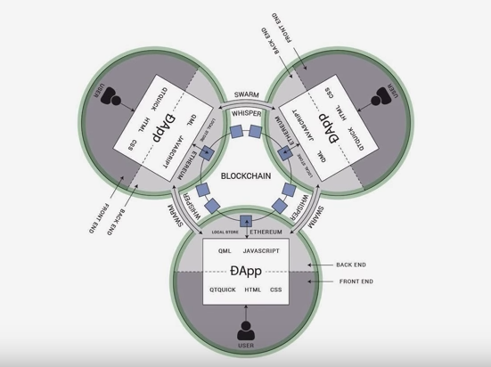
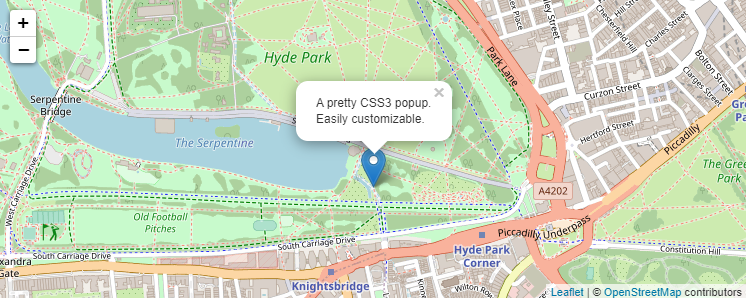
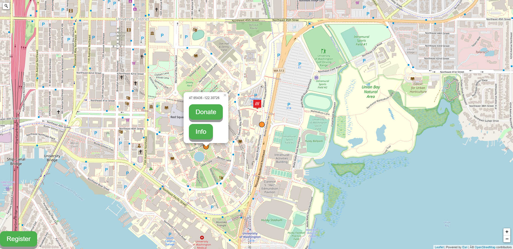

# Geoblockchain Project

Edited by: Jou Ho

## Project Description

### Purpose

The motivation behind this project is to support vulnerable populations around the world. Vulnerable populations include, but not limited to, economically disadvantaged, racial and ethnic minorities, the uninsured, low-income children, the elderly, the homeless, those with human immunodeficiency virus (HIV), and those with other chronic health conditions, including severe mental illness. It may also include rural residents, who often encounter barriers to accessing healthcare services. The vulnerability of these individuals is enhanced by race, ethnicity, age, sex, and factors such as income, insurance coverage (or lack thereof), and absence of a usual source of care. Their health and healthcare problems intersect with social factors, including housing, poverty, inadequate education, and geographical factors, such as access to locations and environmental factors. This project is dedicated to these populations and aims to provide a brand new method to address such groups.

### Authors

The initial idea and design of this project are created by Bo Zhao, a geography professor at the University of Washington and the Principal Investigator at Humanistic GIS Laboratory. The initial development of the application is developed by Jou Ho, an undergraduate student at the University of Washington and a member of HGIS Lab. For more information about the HGIS Lab and us, visit our website at <https://hgis.uw.edu/>.

### Goals

The goal of this project is to create a decentralized application (referred to as DApp) as opposed to typical applications where the backend code is running on centralized servers. This application allows users to donate cryptocurrency to any geographic regions that exist on the earth. This web-based platform will enable us to achieve the following primary goals:

-   Visualize vulnerable population through the levels of donation different geographical region receives. This visualization is open for anyone to see, allowing other people to utilize for reference or any related studies.
-   Provide a brand-new way to donate currency to vulnerable populations using blockchain  technology (explained in later sections), which allows us to create a donation application with the three critical following features, which introduces a more reliable and secured system architecture for donation purposes;
    1.  **Immutability**: no one can alter the stored data nor change the program code for this application for malicious purposes.
    2.  **Transparency**: every stored data, program code, and data processes are accessible for users to see, though immutable.
    3.  **Traceability**: users can keep track of any transactions (explained later) made through the application.
-   Ultimately, support the aforementioned vulnerable populations/geographies through the established donation platform.

### Target Audience/users

The target audience or target users are non-government organizations or individuals who are calling for donations. This application will provide them with a platform to perform a money transaction secured by blockchain technology.

### What is Blockchain and DApp

#### Blockchain

A blockchain is a growing list of records, known as blocks, that are connected using cryptography. Every block contains a cryptanalytic hash of the previous block, a timestamp, and transaction information.

By design, a blockchain is a proof against modification of the information. It is an open, distributed ledger that will record transactions between 2 parties with efficiency and during a verifiable and permanent manner. To be used as a distributed ledger, a blockchain is often managed by a peer-to-peer network. It is put together adhering to a protocol for inter-node communication and confirming new blocks. Once recorded, the information in any given block cannot be altered retroactively without the alteration of all subsequent blocks, which needs a consensus of the network majority. Though blockchain records are not unalterable, blockchains are also thought of as secure by design and exemplify a distributed computing system with high Byzantine fault tolerance. A decentralized agreement has therefore been claimed with a blockchain.

Blockchain was invented by someone (or cluster of people) using the name Satoshi Nakamoto in 2008 to serve as the public transaction ledger of the cryptocurrency bitcoin. The identity of Satoshi Nakamoto is unknown. The invention of the blockchain for bitcoin created the primary digital currency to unravel the double-spending downside without requiring a proper authority or central server. The bitcoin design has inspired different applications, and cryptocurrencies widely use blockchains that are transparent by the general public. Blockchain is taken into account a sort of payment rail. Non-public blockchains are proposed for business use.

#### Decentralized Application (DApp)

DApp is an abbreviated form of decentralized application.
A DApp has its backend code running on a decentralized peer-to-peer network. Contrast this with an app where the backend code is running on centralized servers.

A DApp can have frontend code and user interfaces written in any language (just like an app) that can make calls to its backend. Furthermore, its frontend can be hosted on decentralized storage such as Swarm or IPFS.

In this project, the Ethereum network is used to create a DApp. Ethereum is one of the popular programmable blockchains in the world. Like other blockchains, Ethereum has a native cryptocurrency called Ether (ETH), but unlike other blockchains, Ethereum can do much more since Ethereum is programmable. This means that developers can use it to build new kinds of applications, notably DApp.

If an app = frontend + server, since Ethereum contracts are code that runs on the global Ethereum decentralized peer-to-peer network, then:

DApp = frontend + contracts

Below is a sample of developing smart contract written in a programming language called `solidity`:

    pragma solidity ^0.5.10;

    contract geoDonation {
        constructor() public {
        }

        // a structure that holds information for a location and corresponding donation details
        struct registeredLocation {
            address ownerAddress;
            uint goal;
            uint balance;
            bytes32 description;
            bytes32 owner;
            bytes32 coordinate;
            bool exists;
        }

        // map of registeredLocation as value and coordinate as keys
        mapping(bytes32 => registeredLocation) locations;

        // register and post a donation call
        function register(bytes32 _coordinate, bytes32 _owner, bytes32 _description, uint _goal) public {
            // creates empty registeredLocation struct
            registeredLocation memory c = registeredLocation(msg.sender, _goal, 0, _description, _owner, _coordinate, true);
            // // wallet address of the function caller
            // c.ownerAddress = msg.sender;
            // // target amount of donation
            // c.goal = _goal;
            // // initializes the amount of donation as 0
            // c.balance = 0;
            // // place fopr users to explain the call for this donation
            // c.description = _description;
            // // owner of this donation post. ex: XXX organization
            // c.owner = _owner;
            // // set exists to true
            // c.exists = true;
            // // add this struct to the locations mapping
            locations[_coordinate] = c;
        }

        // donate money to a location upon checking if the location is registered
        function donate(uint amount, bytes32 latlng) public {
            require(locations[latlng].exists);
            locations[latlng].balance += amount;
        }

        function getOwnerInfo(bytes32 latlng) public view returns (bytes32) {
            require(locations[latlng].exists);
            return locations[latlng].owner;
        }

        // returns how much is donated to a location
        function getBalance(bytes32 latlng) public view returns (uint) {
            require(locations[latlng].exists);
            return locations[latlng].balance;
        }

        // when retrieving the donation money, check if the function caller is the owner of this donation post
        function isOwner(bytes32 _coordinate) public view returns (bool) {
            if (locations[_coordinate].ownerAddress == msg.sender)
                return true;
        }
    }

For more information about `solidity` language, refer to their official documentation [here](https://solidity.readthedocs.io/en/latest/).

### Strengths and Weaknesses of Blockchain-based DApp

#### Strengths

The main advantages of using decentralized applications:

-   Payment processing does not require a third-party financial operator. In a decentralized network, transactions between users are performed directly and in cryptocurrency.
-   There is no need for registration or subscription due to the use of public and private keys for accessing data.
-   Open source and civil registry make sure the platform is transparent and easy to use.

These criteria are all beneficial in the development of a donation application.

#### Weaknesses

The main disadvantages of using decentralized applications:

-   Fixing bugs or updating DApps is difficult, as every peer in the network has to update their node software.
-   Some applications require verification of user identity, and as there is no central authority to verify the user identity, it becomes an issue while developing such applications.
-   They are challenging to build because they use complex protocols to achieve consensus and **they have to be made to scale from the start itself** (very important). So we cannot just implement an idea and then, later on, add more features and scale it.

These weaknesses are something that is yet to be solved for this project. We will need further ideas and improvements to our DApp in the future.

### Major Functions

The following are the main functionalities of this DApp, although these are subject to change, new functions may be added in the course of development.

-   A web map that allows users to navigate through different geographical regions.
-   A search bar in which users can type in the address, place, or country to find their location of interests.
-   Users can post or create a new call for donations by filling a registration form. The input values include the name of the organization or individual calling for donation, a description of why they need donation, and the amount of Ether they would like to achieve for their donation.
-   Visualization of posted donations by markers on the map. Different levels of color could also visualize the amount of donation.
-   Pop up windows that show up upon clicking on the markers. This window contains information about the donation post, such as the name of organization/individuals/population groups, description of the donation post (why do they need donation? who will be supported by the donation?), and the total amount of donation they already received, etc.
-   Users can donate their cryptocurrency to a location by clicking on the "donate" button on the pop-up window for each donation post. They can decide how much cryptocurrency (Ether) to donate.
-   A person who created the donation post can retrieve donated money to their cryptocurrency wallet (metamask)

Above are the main functions of this DApp. However, there are and will be, functions and details that will be needed in the future development of this application. This includes:

-   professional website design
-   professional data visualizations
-   functionalities that attract large enough number of users
-   security measures against malicious use of these applications
-   improving overall user experience (UX) and user interface (UI)

### System Architecture

#### Client Tier

HTML, JavaScript, and CSS that compose a user interface. For the base map, the leaflet's open street map is used for a simple and intuitive styled map. These UI elements are subject to change for improvements.

Open Street Map view:

Sample image of the application UI:

#### Logic Tier

JavaScript is used to connect to the data stored inside the Ethereum blockchain. It also processes the data retrieved from blockchain to visualize them in UI.

#### Data Tier

A smart contract represents the data structure and data storage for this DApp. It is written in `solidity` language and defines data structure and functions to be deployed to the Ethereum network. This smart contract can then be utilized to store and access data from external calls.

### Main Libraries and Resources

| Library | Description                                                                                                                                                                                                                                                                         | Usage in this Project                                                                                                                      |
| ------- | ----------------------------------------------------------------------------------------------------------------------------------------------------------------------------------------------------------------------------------------------------------------------------------- | ------------------------------------------------------------------------------------------------------------------------------------------ |
| Web3.js | web3.js is a collection of libraries which allow you to interact with a local or remote Ethereum node, using an HTTP or IPC connection.                                                                                                                                             | Used to talk to the Ethereum node, which allows utilizing the smart contract.                                                              |
| jQuery  | jQuery takes a lot of common tasks that require many lines of JavaScript code to accomplish and wraps them into methods that you can call with a single line of code. jQuery also simplifies a lot of the complicated things from JavaScript, like AJAX calls and DOM manipulation. | Used to write javascript more straightforwardly.                                                                                           |
| Leaflet | Leaflet is a widely-used open-source JavaScript library used to build web mapping applications.                                                                                                                                                                                     | Used to access different base map features and extensions that can be added, such as address search bar, to create an interactive web map. |

### Challenges and Concerns

Below are some of the significant challenges and concerns that we need to consider upon further developing this application:

-   How to attract a stable number of users? A reliable business strategy for spreading this application is crucial, whether it could be an advertisement, sponsorship, or post on social media.
-   Similar to the above, what are the advantages of using this application over other related donation application? This distinction must be made clear to clarify the benefits of using DApp and attract more users.
-   Political implications and research politics must be considered. Since decentralized applications using blockchain do not require a central data manager, independency from authorities such as tech companies might imply anarchistic ideas. To clarify, this project's purpose is purely to support people in need of financial support, and we try to limit the politics of this research as much as possible.

### Ackowledgement
This project and the application is still under development. The source code will be published once the application is publicly deployed.

### Contacts

If you are interested in this project or would like to provide any ideas, please contact Jou Ho at jouh@uw.edu.
